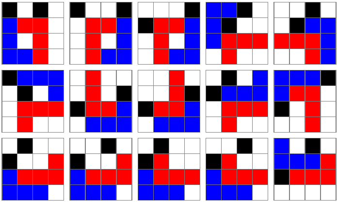

# The L game

https://en.wikipedia.org/wiki/L_game

Generates the transition graph of all 2296 symmetry-reduced positions. Visualization and graph analysis is done in Mathematica.

Also prints the 15 winning positions (blue can not move). 

